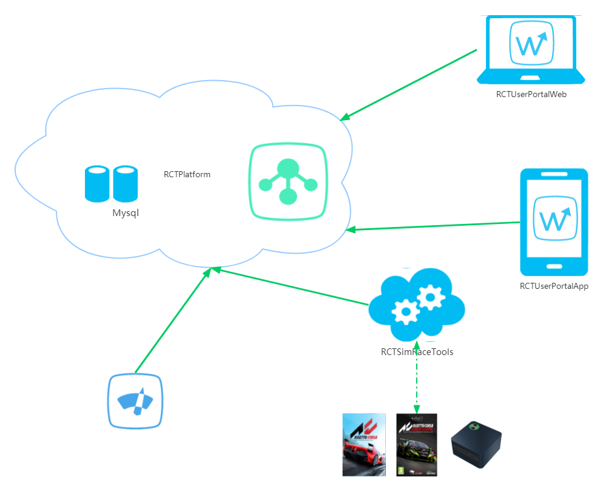

# RaceCarTelemetry
采集 ACC,AC,赛豆现实赛车摇测数据，上传到平台上进行分享，分析，排名奖励。数据获取者将获得赛车能力的提升，数据和赛车调校分享者将会获得收益。

## [RCTAdminPortalWeb](./rct_admin_portal_web) 
后台管理WEB项目，采用VUE+ElementUI开发->远程调用RCTPlatform.
## [RCTUserPortalWeb](./rct_user_portal_web)
用户数据分析WEB项目，采用VUE+ElementUI开发->远程调用RCTPlatform.
## [RCTUserPortalApp](./rct_user_portal_app)
用户数据分析手机App项目，采用flutter开发->远程调用RCTPlatform.
## [RCTSimRaceTools](./rct_simrace_tools)
模拟器(ACC,AC)数据采集项目，采用VUE+Electron+ElementUI开发->上传数据至RCTPlatform.
## [RCTPlatform ](./rct_platform) 
数据中心项目，采用PHP+CodeIgniter框架开发.